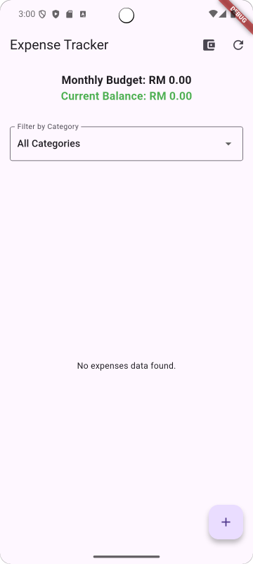

# Expense Tracker

An expense tracker application

## Getting Started

App first launched view

Click the wallet icon to open this screen (top-right) to add monthly budget

Click the Floating action button at the bottom right to add an expense

Screen when there is data to display

